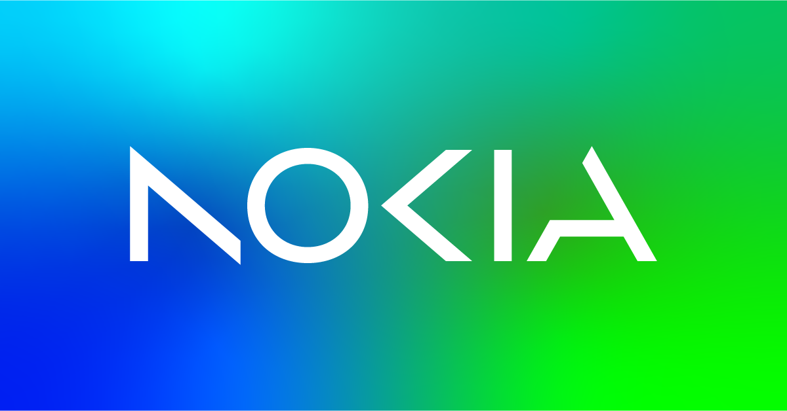

# Awesome Nokia

> A curated list of awesome projects and useful resources for working with Nokia network devices.

## 📦 Containerlab
- [Containerlab](https://containerlab.dev) - Open-source virtual network lab orchestrator.
- [Containerlab GUI](https://containerlab.dev/manual/gui/) - GUI for Containerlab available as a VS Code extension, desktop app, self-hosted web app, or in a public browser sandbox.
- [Antimony](https://github.com/antimony-team/antimony) - Alternative GUI and lab manager focused on educational environments created at the Eastern Switzerland University of Applied Sciences.
- [vrnetlab](https://github.com/srl-labs/vrnetlab) - Tool to convert VM-based network device images into Containerlab-compatible containers.
- [Clabernetes](https://github.com/srl-labs/clabernetes/) - Containerlab in kubernetes allowing larger scale-out labs.
- [Discord Community](https://discord.gg/vAyddtaEV9) - Official Containerlab community chat.

## 🐧 SR Linux
- [SR Linux Lab Container](https://learn.srlinux.dev) - Virtual SR Linux node for lab use.
- [Pydantic Models](https://github.com/srl-labs/pydantic-srlinux) - Generate Python [Pydantic validation](https://pydantic.dev/docs/validation/latest/get-started/) models for configuration paths.
- [YANG Browser](https://yangbrowser.nokia.com/srlinux) - Searchable database of all SR Linux model paths (gNMI, JSON, etc.).
- [VS Code Language Server](https://marketplace.visualstudio.com/items?itemName=srl-labs.sr-vscode) - Advanced auto-completion and schema validation for SR Linux and SROS configurations ([Git Repo](https://github.com/srl-labs/vscode-sr)).
- [MultiCLI](https://github.com/srl-labs/MultiCLI) - CLI plugin emulating common commands of other vendor NOSes to ease migration.
- [SR Linux GPT](https://learn.srlinux.dev/blog/2023/sr-linux-gpt/) - Application integrating OpenAI ChatGPT as an agent into the command line.
- [Front Panel CLI Plugin](https://github.com/srl-labs/frontpanel-cli-plugin) - Visual representation of switch front panel and port statuses directly in the terminal.
- [Conversion Tool](https://github.com/srl-labs/srlconv) - Convert configurations between software versions and compare representations.
- [Custom SNMP Framework](https://learn.srlinux.dev/snmp/snmp_framework/) - Guide for creating custom SNMP MIBs in SR Linux.
- [Ansible Collections](https://galaxy.ansible.com/ui/repo/published/nokia/srlinux/) - Ansible modules for automation ([Git Repo](https://github.com/nokia/srlinux-ansible-integration)).
- [Nokia SR Skills](https://github.com/antoinekh/nokia-sr-skills/) - Claude Skill plugin teaching agents how to inspect and operate Nokia SR Linux and SROS models and devices.
- [SR Linux YANG models](https://github.com/nokia/srlinux-yang-models) - Nokia SR Linux YANG models.
- [Discord Community](https://discord.gg/tZvgjQ6PZf) - Official SR Linux and SROS community chat.

## ☁️ EDA (Event-Driven Automation)
- [Try-EDA Playground](https://github.com/nokia-eda/playground) - Run Nokia EDA locally for free.
- [CodeSpaces Playground](https://docs.eda.dev/26.4/software-install/non-production/codespaces/) - Run EDA for free on GitHub CodeSpaces compute.
- [VS Code Extension](https://marketplace.visualstudio.com/items?itemName=eda-labs.vscode-eda) - Interface for reading and writing configuration and state ([Git Repo](https://github.com/eda-labs/vscode-eda)).
- [Ansible Collections](https://ansible.eda.dev/) - Ansible modules for EDA.
- [Terraform Providers](https://registry.terraform.io/namespaces/nokia-eda) - Terraform integration for EDA.
- [Pydantic Models](https://github.com/eda-labs/pydantic-eda) - Generate Python [Pydantic validation](https://pydantic.dev/docs/validation/latest/get-started/) models for EDA custom resources.
- [TopoBuilder](https://topobuilder.x.eda.dev/) - Web app for creating topologies importable via EDA Network Topology workflow ([Git Repo](https://github.com/eda-labs/topo-builder)).
- [Discord Community](https://eda.dev/discord) - Official EDA community chat.

## 🧩 NSP (Network Services Platform)
- [Telemetry Pipelines](https://github.com/asadarafat/nokia-nsp-telemetry) - modular, proof-of-concept telemetry pipeline scenarios built around Nokia NSP (Network Services Platform) telemetry
- [Ansible Collection](https://github.com/nokia/nsp-ansible-integration) - Ansible collection for orchestrating NSP via Restconf APIs.
- [VSCode Workflow Manager Plugin](https://github.com/nokia/vscode-workflow-manager) - VSCode plugin for managing, creating and writing WFM workflows.
- [VSCode Intent Manager Plugin](https://github.com/nokia/vscode-intent-manager) - VSCode plugin for managing, creating and writing NSP Intent types.
- [Automation Examples](https://github.com/nokia/nsp-automation) - curated collection of programmable examples of workflows and intent-types for NSP.

## 🌐 SROS
- [SR-SIM Lab Container](https://documentation.nokia.com/sr/26-3/7x50-shared/srsim-installation-setup/getting-started.html) - Virtual SROS node for lab use (requires Nokia Support or Sales portal access).
- [SR-SIM HW Schema App](https://github.com/FloSch62/srsim-hw-schema) - Generate and validate Containerlab hardware configurations for SR-SIM nodes.
- [VS Code Language Server](https://marketplace.visualstudio.com/items?itemName=srl-labs.sr-vscode) - Auto-completion and schema validation for SROS and SR Linux configurations ([Git Repo](https://github.com/srl-labs/vscode-sr)).
- [YANG Browser](https://yangbrowser.nokia.com/sros) - Searchable database of all SROS model paths.
- [pySROS](https://network.developer.nokia.com/static/sr/learn/pysros/latest/introduction.html) - Model-driven Python client libraries.
- [SROS Books](resources/colin-bookham-books/) - Deep-dives by Colin Bookham:
	- [Versatile Routing and Services with BGP Volume II](resources/colin-bookham-books/Versatile%20Routing%20and%20Services%20with%20BGP%20Volume%20II%20[Issue%201].pdf)
	- [Implementing Segment Routing with SR-OS](resources/colin-bookham-books/Implementing%20Segment%20Routing%20with%20SR-OS%20[Issue%201.15].pdf)
- [Ansible Collections](https://galaxy.ansible.com/ui/repo/published/nokia/sros) - Ansible modules for automation ([Git Repo](https://github.com/nokia/sros-ansible-integration)).
- [Nokia SR Skills](https://github.com/antoinekh/nokia-sr-skills/) - Claude Skill plugin teaching agents how to inspect and operate Nokia SR Linux and SROS models and devices.
- [SROS YANG Models](https://github.com/nokia/7x50_YangModels) - Nokia SROS YANG models.
- [Discord Community](https://discord.gg/tZvgjQ6PZf) - SROS community channel within the SR Linux Discord.

## 🛠️ General Networking & Automation
- [Network Design Hub](https://documentation.nokia.com/networks-design-hub/index.html) - Nokia Validated and Reference Design Guides.
- [AI Network Calculator](https://networkcloudandeverything.com/2-tier-gpu-fabric-calculator/) - 2-tier GPU fabric calculator.
- [ProtoMap](http://protomap.netdevops.me) - Visualizer for gNMI, gNOI, gNSI, and gRIBI service specifications.
- [gNMIc](https://gnmic.openconfig.net/) - Open source gNMI client by Nokia.
- [gNMIc Operator](https://operator.gnmic.dev/) - Deploy and manage gNMIc telemetry collectors on Kubernetes.
- [NETCONF VS Code Extension](https://marketplace.visualstudio.com/items?itemName=Nokia.netconf-client) - NETCONF client for VS Code ([Git Repo](https://github.com/nokia/vscode-netconf)).
- [Robot Framework](https://robotframework.org/) - Open source automation framework for test and robotic process automation (RPA) started by Nokia.
- [Kubenet](https://learn.kubenet.dev/) - Open source community projects using Kubernetes for network automation.

---

> [!CAUTION]
> The README markdown content in this repository is licensed under the [MIT License](LICENSE).
> 
> **Wait! Read this before copying:**
> The PDF books located in the `resources/colin-bookham-books` directory are **NOT** covered by the MIT license. They are the copyrighted property of their respective authors and are distributed here with explicit permission. You may not modify, sell, or redistribute these books outside the context of this repository without obtaining your own permission from the copyright holders.
